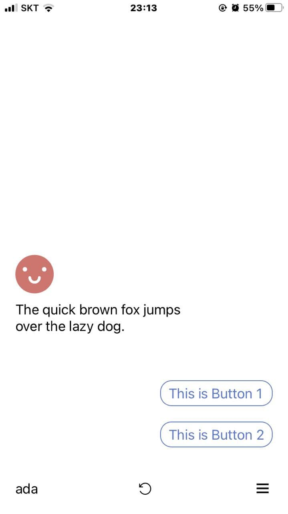
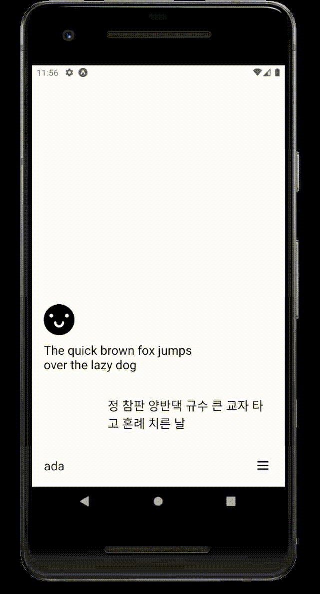
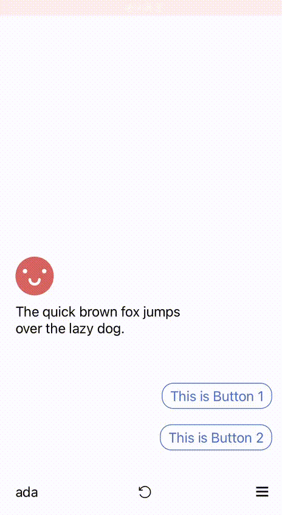
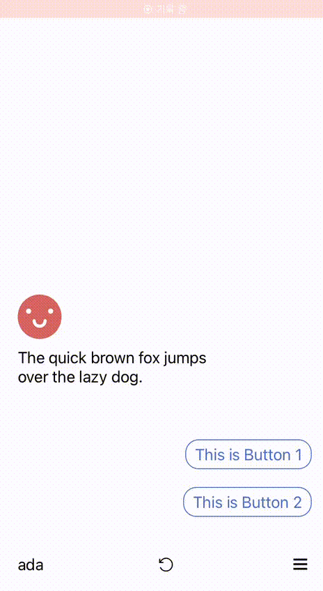

# clone-ada

Ada Health의 모바일 어플리케이션을 클론해보는 프로젝트입니다.

UI를 대부분 비슷하게 구성해보려고 합니다.

## 실행

Expo를 사용해 개발헀기 때문에, 운영체제에 상관없이 안드로이드 폰, IOS 폰에서 Expo Go 앱을 통해서, 이 프로젝트를 실행해 볼 수 있습니다.

```
yarn start
```

위 명령어로 로컬 환경에서 앱을 실행하고, 브라우저에 표시되는 QR코드를 통해서 Expo Go 앱으로 실행할 수 있습니다.

혹은 [https://expo.dev/@gincheong/cloneada](https://expo.dev/@gincheong/cloneada) 링크를 통하면, 제가 Publish한 앱을 마찬가지로 Expo Go 앱으로 실행할 수 있습니다.

[2e886a6](https://github.com/gincheong/clone-ada/commit/2e886a6410e476a741b4d0d4499f5a43b06778e1)까지 반영되어 있습니다. (10/24 21:56)

## 구현사항 (스크린샷)

### 메인 화면



### 사이드바



### 대화 이동



버튼/텍스트박스 입력 시에, 고정 수치의 딜레이를 넣은 상태입니다.

### 언어 변경


